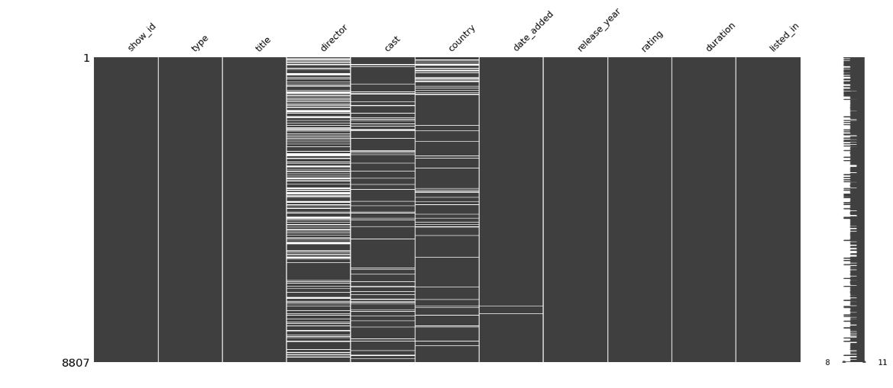

# analysis-and-visualize

There is 2 different dataset in this repository, One of them is the Netflix dataset and one is bike store sale, ther notebooks show  how to clean and visualize data inforrrmation.
# Netflix Data Visualization

## Background

TV Shows and Movies listed on Netflix

This dataset consists of tv shows and movies available on Netflix as of 2019. The dataset is collected from Flixable which is a third-party Netflix search engine.

In 2018, they released an interesting report which shows that the number of TV shows on Netflix has nearly tripled since 2010. The streaming service’s number of movies has decreased by more than 2,000 titles since 2010, while its number of TV shows has nearly tripled. It will be interesting to explore what all other insights can be obtained from the same dataset.

Integrating this dataset with other external datasets such as IMDB ratings, rotten tomatoes can also provide many interesting findings.

Inspiration

Some of the interesting questions (tasks) which can be performed on this dataset -

Understanding what content is available in different countries

Identifying similar content by matching text-based features

Network analysis of Actors / Directors and find interesting insights

Is Netflix has increasingly focusing on TV rather than movies in recent years.

There is some null values in some columns.

after dealing with missing value and duplicated value :

Distribution of top 10 countries:

Top 10 countries based on maturity rating:

Top 10 Date of month and year content addedd based on type:

Distribution of release_year of movie versus release_year of show TV:

Number of Movie Type:

## Dataset References

[https://www.kaggle.com/shivamb/netflix-shows](https://www.kaggle.com/shivamb/netflix-shows)

# Europe bikes dataset

In Europe bikes dataset , Extract the insight of sales in each country and each state of their countries.

In this dataset 18 columns and main column is sales , in this columns

Extract the value bale and meaningful insight from it

Sales According to male and female or Products

number of each product and its sales and so on.

## Dataset References

[https://www.kaggle.com/sadiqshah/bike-sales-in-europe](https://www.kaggle.com/sadiqshah/bike-sales-in-europe)
